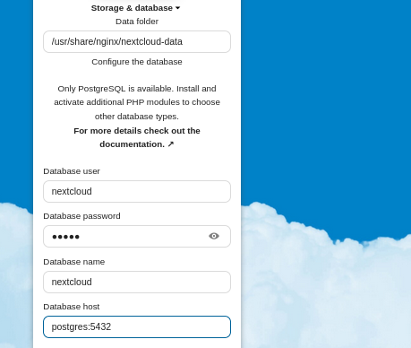

# Home server

Applications installed on my local network using docker-compose:

1. NextCloud (PostgreSQL, Redis and Nginx)

### Setup (NextCloud)

1. Install docker & docker-compose
2. Configure: `example.env` and rename the file to `.env`
3. Run: `docker-compose up -d`
4. Go to your nextcloud server web domain and it should be available here.
5. \*Setup the server.
6. Run `docker exec -it homeserver_nextcloud_1 ./postsetup.sh` to complete the installation.
7. Enjoy.

\*Please note that your database settings are as followed in the image (Database password is whatever value you've set for NEXTCLOUDDB_PASS in .env):

